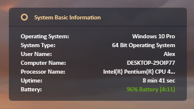

# NexaX

 

Набор скинов для Rainmeter. За основу был взят дизайн виджетов [Nexa](https://7themes.su/news/nexa/2017-07-02-1282) с добавлением необходимого функционала.

# Что входит
- Часы

  

  
- Основная информация о системе

  

 
- Информация об использовании процессора и оперативной памяти

  

- Информация о дисках, подключаемых USB-устройствах и корзине

  

- Музыкальный проигрыватель

  

- Сетевой монитор

  

# Установка
## Автоматическая установка
1. Загрузите последнюю версию скина здесь: https://github.com/BlasterAlex/NexaX/releases

2. Установите скин, запустив **.rmskin** и пройдя через установщик.

3. После завершения установки **NexaX** появится в списке активных скинов.

## Ручная установка
1. Клонируйте этот репозиторий в **Documents\Rainmeter\Skins**.

2. Запустите Rainmeter и щелкните правой кнопкой мыши на кнопку **Обновить всё**.

3. После обновления в списке активных скинов появится папка **NexaX**.

# Благодарность
- [Nexa](https://7themes.su/news/nexa/2017-07-02-1282) — основной дизайн окон
- [Gotham](https://7themes.su/news/gotham_for_rainmetter/2016-04-21-1174) — скин часов
- [Bolo](https://7themes.su/news/bolo_monitoring_sistemy/2012-09-09-415) — элементы интерфейса
- [Kantas Akra](https://visualskins.com/skin/kantas-akra) — музыкальный проигрыватель
- [USB DISK EJECTOR](https://quickandeasysoftware.net/software/usb-disk-ejector) — аддон для извлечения usb